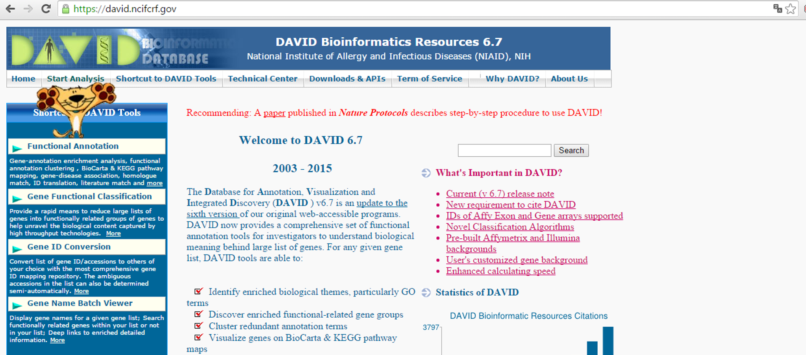
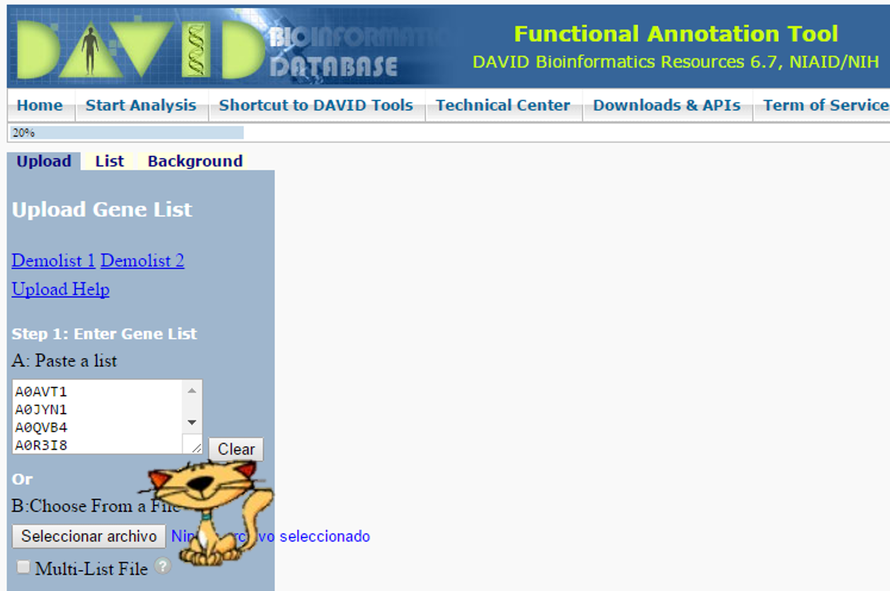
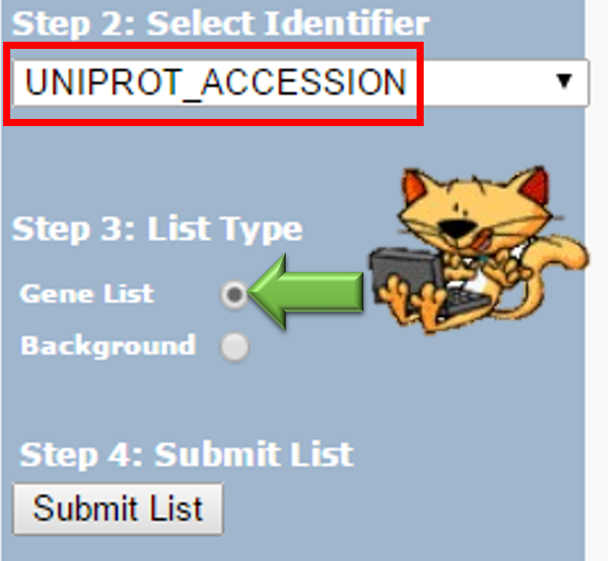
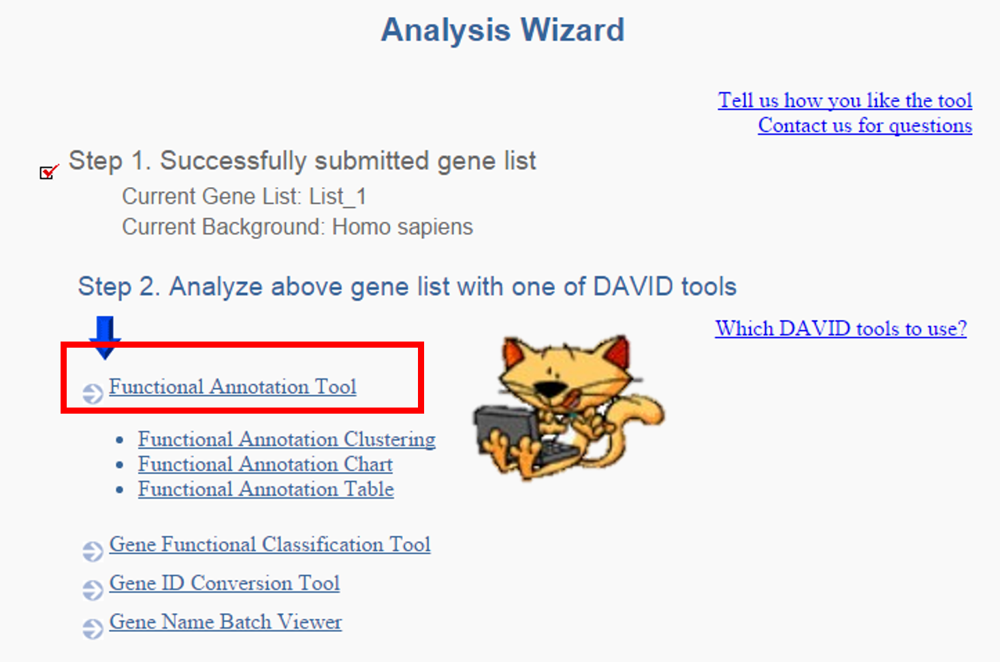
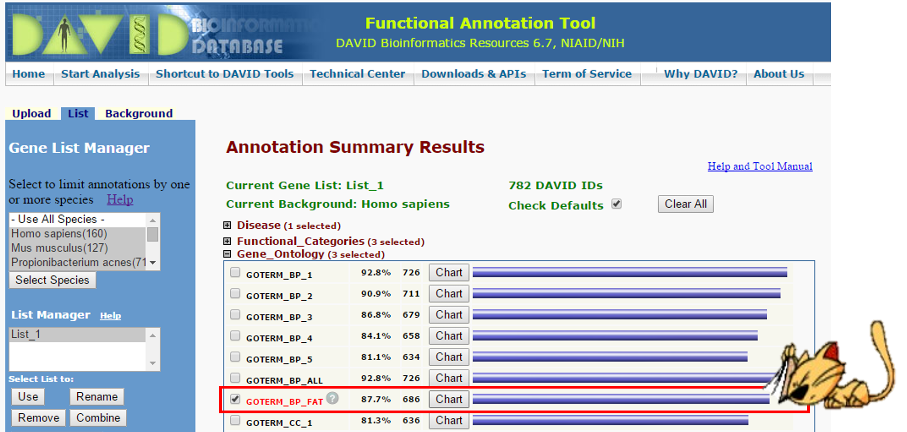
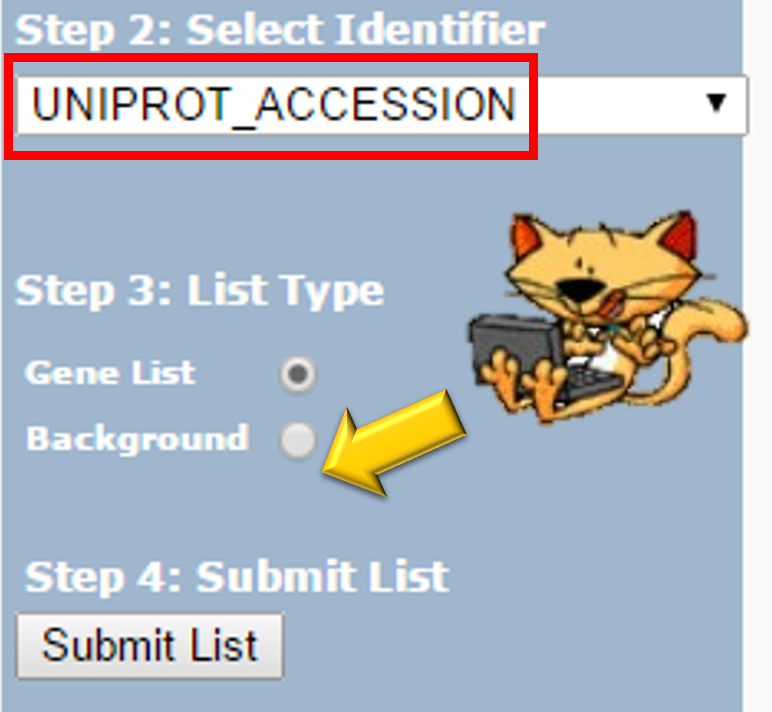
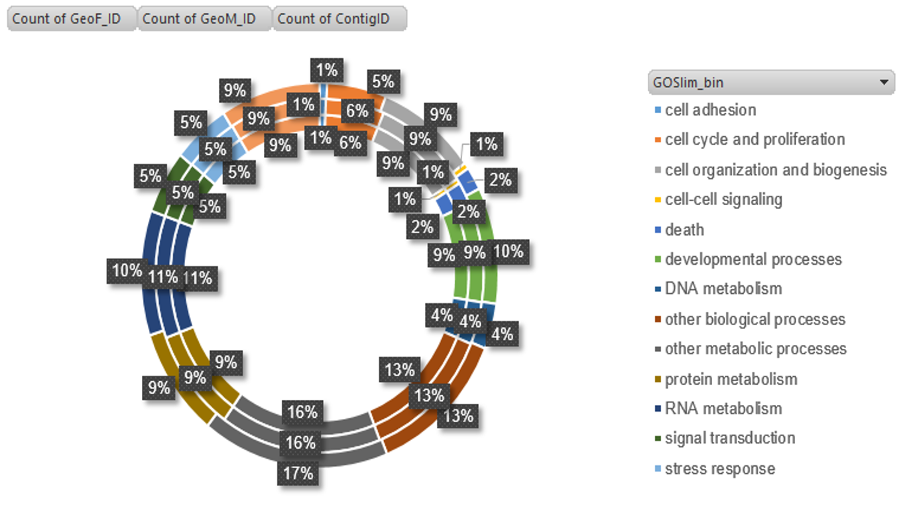
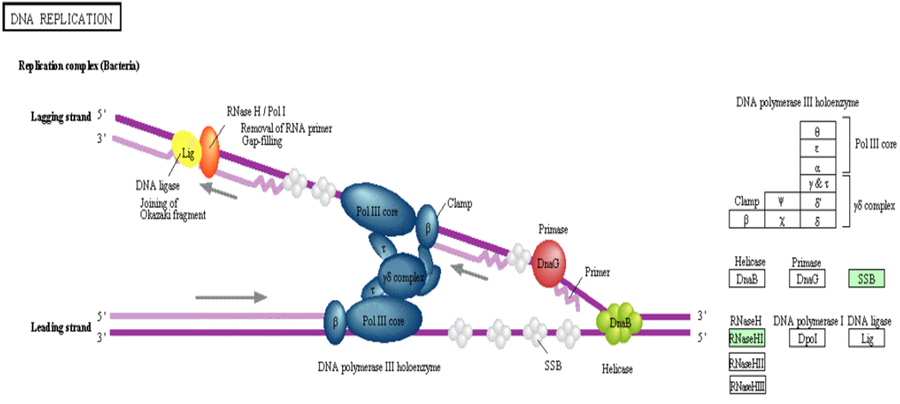
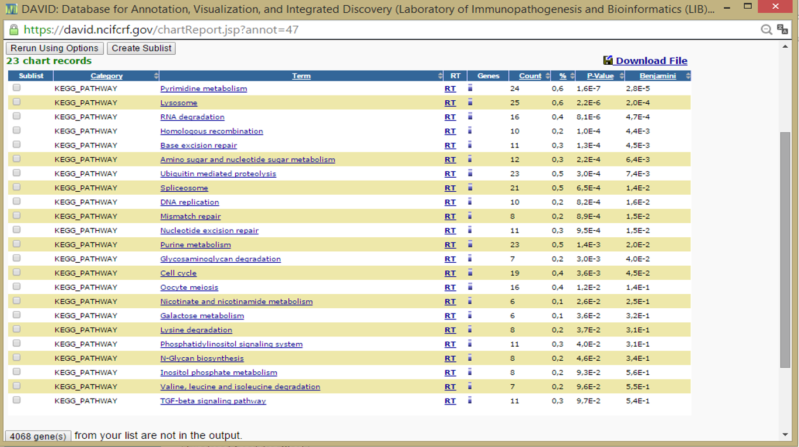

---
#How annotate genes in DAVID plataform?
---


*First you should know What is DAVID?*  

<p style="text-align: justify;">DAVID 1.x was originally designed as a  web-based functional annotation tool, particularly for gene-enrichment analysis,on DAVID knowledgebase which contains annotations and gene asccessions linked by LocusLink IDs in 2003 version. As the result of continuely improving, DAVID 2.x provides a largest integrated annotation knowledgebase based on newly developed  "DAVID Gene Concept", a graph theory evidence-based method  to agglomerate heterogeneous and widely distributed public databases. It also provides an enhanced set of bioinformatics tools, not only limited to functional annotation, to  systematically summarize the relevant biological patterns from user-classified gene list. Therefore, users can quickly understand the biological themes under the study.   As committed to continuely addressing the challenges of system biology, DAVID  will keep upgrading and more tools are under developing. See more information and common questions on: [https://david.ncifcrf.gov/content.jsp?file=FAQs.html#1](https://david.ncifcrf.gov/content.jsp?file=FAQs.html#1)</p>

#Now you go to DAVID page 
```
https://david.ncifcrf.gov/
```
and clic on Start Analysis:



Next you copy and paste in the List window the ID of your genes

For example:

- P63018
- P49165
- Q7SXM7
- Q9UHV9
- Q8R323
...

>Make sure you don't have any duplicates in your database




#Then you can select Functional Annotation Tool



>**Next you can see several options, you need to clic on Gene_Ontology option and then select a case like in the next picture** 



#If you get here... CONGRATS!!! 

Now you can save the data and manage them. Yo can also make a background and do the same process and you have more information about your data base


>Example of results:

#MORE EXAMPLES: DNA Replication


#MORE EXAMPLES: Pyrimidine metabolism


#MORE EXAMPLES: All you wanna now about your genes


#And a little bit more...


One software that could help you for more data analysis is REVIGO ```http://revigo.irb.hr/
```

